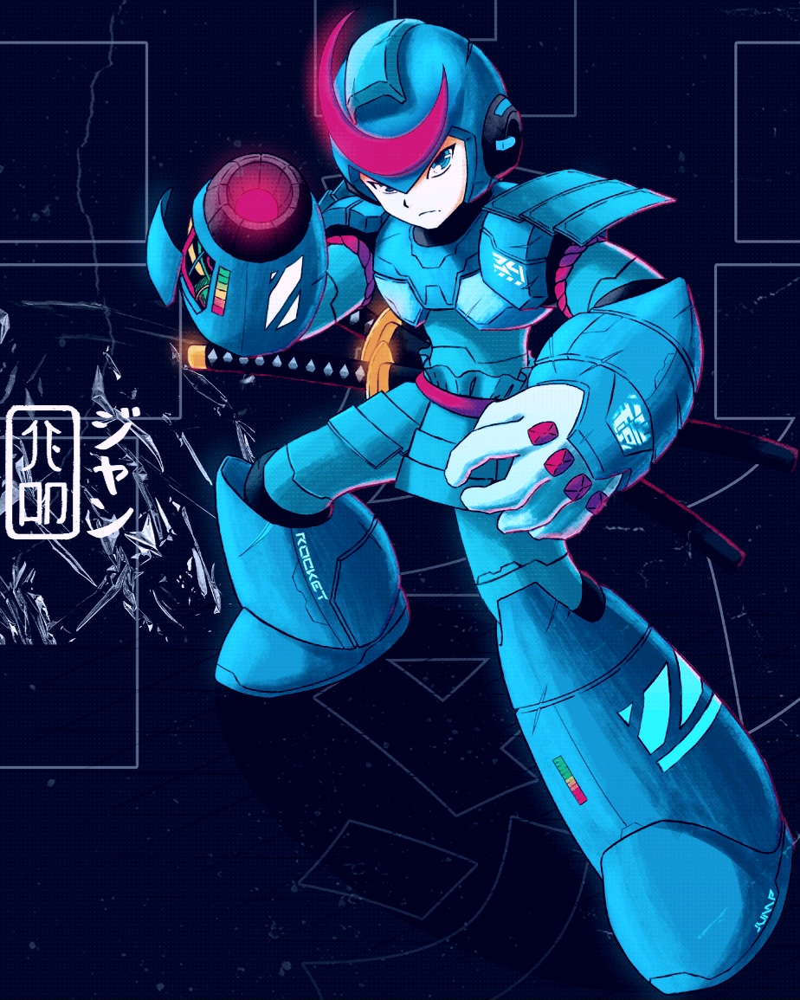
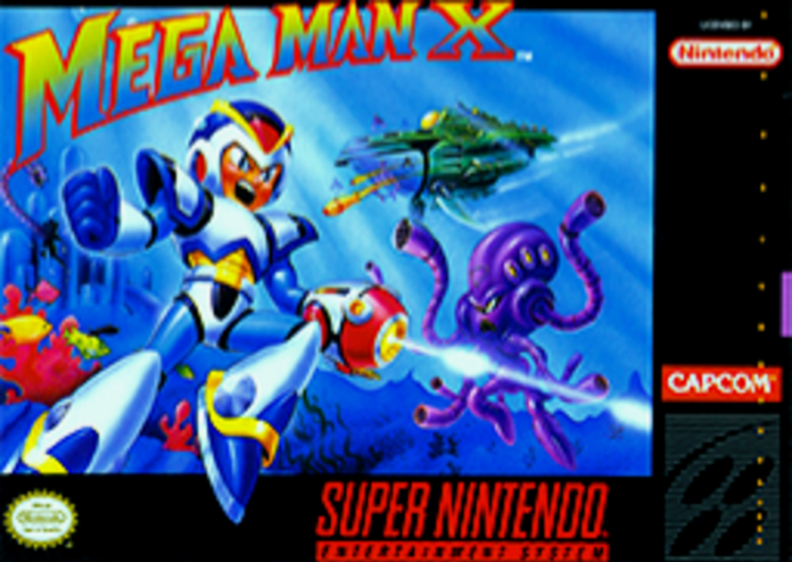

<!DOCTYPE html>
<html lang="pt-br">
<head>
    <meta charset="UTF-8">
    <meta http-equiv="X-UA-Compatible" content="IE=edge">
    <meta name="viewport" content="width=device-width, initial-scale=1.0">
    <title>Página Principal</title>
    <link rel="stylesheet" href="/Desafio HTML3/css.css">
    
</head>
<body>

    
   
        

          
            <pre align="">  <a href="https://www.arcadeflix.com.br/2022/05/mega-man-x-snes.html" onMouseOver="this.style.color='#fa0'" onMouseOut="this.style.color='#00a'">JOGOS DE MEGAMAN</a>   <a href="https://xbuster.wordpress.com/2011/06/10/megaman-x-fraquezas-de-chefes/" onMouseOver="this.style.color='#fa0'" onMouseOut="this.style.color='#00a'">CHEFÕES DE MEGAMAN X</a>   <a href="https://youtu.be/UAIfRg7E-ug?si=c27gJBN30D_scxqL" onMouseOver="this.style.color='#fa0'" onMouseOut="this.style.color='#00a'">ARMADURA</a>   <a href="https://youtu.be/ojDq5Rqe3nQ?si=feny2MZY_Eo66xEv" onMouseOver="this.style.color='#fa0'" onMouseOut="this.style.color='#00a'">HADOUKEN E ITENS</a></pre>
        

    

    

    

        

            <h2>MEGAMAN X</h2>
            <ul>
                <li><a href="#mega">INÍCIO</a></li>
                <li><a href="#jogabilidade">JOGABILIDADE</a></li>
                <li><a href="#historia">HISTÓRIA</a></li>
                <li><a href="#personagens">PERSONAGENS</a></li>
                <li><a href="#upgrad">UPGRADE</a></li>
            </ul>
        

        

          <h2 id="mega">Mega Man X (jogo eletrônico)</h2>
            
Mega Man X, conhecido no Japão como Rockman X (ロックマンX Rokkuman Ekkusu?), é um jogo de plataforma com elementos de ação lançado pela Capcom em 1993 para o Super Nintendo (SNES), é o primeiro jogo de Mega Man em um console de 16-bits. O primeiro jogo da série Mega Man X, sendo a primeira subsérie da série Mega Man, que havia surgido no antecessor do SNES, o Nintendo Entertainment System (NES). Mega Man X foi lançado no Japão em 17 de dezembro de 1993, e no ano seguinte, na América do Norte e na Europa.

            <figure></figure>
            
O jogo segue o protagonista Mega Man X, um membro androide de uma força-tarefa militar chamada de "Maverick Hunters". Com a ajuda de seu parceiro Zero, X deve frustrar os planos de Sigma, um líder maverick poderoso que deseja trazer a extinção humana. Mega Man X foi recebido com críticas positivas para a sua jogabilidade, som e gráficos, se tornando um sucesso comercial no console SNES. O jogo recebeu conversão para MS-DOS em 1995, e um remake para PSP em 2005, intitulado Mega Man Maverick Hunter X. Também fora relançado na compilação Mega Man X Collection (2006), para PlayStation 2 e Nintendo GameCube, além de ter sido disponibilizado para download no Virtual Console do Wii em 2011, do Wii U em 2013 e do New 3DS em 2016. Há ainda versões para telefones celulares e para os sistemas operacionais Android e iOS. <a href="index.html"><button id="voltar" onMouseOver="this.style.color='#fa0'" onMouseOut="this.style.color='#00a"> VOLTAR</button></a>

            
            
              <h2 id="jogabilidade">JOGABILIDADE</h2>
            
Apesar da storyline e dos personagens diferentes, o modo de jogo é bem similar à série original de Mega Man, com diversas exceções - mais notavelmente: X pode escalar paredes e deslizar para baixo, e cápsulas de upgrades de armaduras podem ser encontradas em várias fases que exibem uma mensagem holográfica do Dr. Light quando X se aproxima. Do segundo jogo em diante, Zero é armado com o Z-Saber (uma espécie de sabre de luz, similar ao da série Star Wars) além do mais que tradicional canhão de plasma. Os Mavericks substituem os Robôs Mestres e Sigma substitui o Dr. Wily.
            
            O jogador assume o controle do protagonista X, e depois de completar uma fase introdutória, é apresentado uma tela de seleção de fases que retrata oito personagens chefes. Cada etapa está repleta de vários inimigos e perigos, e termina com uma batalha contra um chefe de seu respectivo maverick. Completando uma fase o jogador é recompensado com uma nova arma. O jogador pode tentar passar por estes oito níveis em qualquer ordem, usando armas obtidas em uma fase para superar desafios nas outras fases.
            
            O jogador também pode recolher os ocultos "Heart-Tanks" que estendem ao máximo a energia vital de X, e "Sub-Tanks" que podem armazenar energia extra para uso posterior. Completar algumas fases irá afetar sutilmente a paisagem de outras fases. Por exemplo, completar a fase porta-aviões de Storm Eagle irá causar falhas elétricas na fase usina de Spark Mandrill. Quando forem respeitadas determinadas condições, uma cápsula secreta pode ser desbloqueada o que dá a X uma capacidade para realizar o "Hadouken", um ataque usado por personagens da série Street Fighter também da Capcom.
            <a href="index.html"><button id="voltar" onMouseOver="this.style.color='#fa0'" onMouseOut="this.style.color='#00a"> VOLTAR</button></a>
            

            <h2 id="historia">História</h2>
            

              Mega Man X se passa no século XXII em ano indeterminado, cerca de 100 anos após a série Mega Man original. Um arqueólogo humano chamado Dr. Cain descobre ruínas de uma instalação robótica de pesquisa que por uma vez já foi operada pelo lendário designer de robôs-androides Dr. Thomas Light (o criador do Mega Man). Entre as ruínas, Dr. Cain encontra uma grande cápsula que contém um robô altamente avançado com a inteligência e emoções de nível humana, e até mesmo tomar suas próprias decisões, esse robô era Mega Man X. No entanto, todas essas habilidades poderiam ser perigosas para a humanidade, caso algum "X" se voltasse contra os seus criadores, e por isso, Dr. Light antes de sua morte tinha a intenção de inserir dentro de sua criação a sanidade e boa natureza, e assim o robô ficou inativo durante a execução de um programa de diagnóstico de 100 anos para garantir esses recursos.
              
              Cain passa vários meses estudando o robô, que é chamado de "Mega Man X" (ou simplesmente "X"). e criou uma nova legião de robôs-androides "pensantes" a partir dele, que foram batizados de "Reploids". Porém, com o livre arbítrio dado a um reploid, vem a possibilidade de atividades criminosas; tais reploids desonestos são nomeados como "Mavericks" pelos humanos. O governo cria uma força policial reploid de elite (conhecido como "Maverick Hunters"), liderado pelo mais recente projeto do Dr. Cain, Sigma. Por um tempo Sigma controlou bem a situação, porém mais tarde ele também se tornou um maverick e declarou guerra contra os humanos, agora liderando o exército inimigo. X, acaba possuindo um sentimento de culpa por ter ajudado a projetar todos esses eventos catastróficos, e então junta forças com o único outro Maverick Hunter restante, o seu parceiro Zero, a fim de parar a qualquer custo Sigma. <a href="index.html"><button id="voltar" onMouseOver="this.style.color='#fa0'" onMouseOut="this.style.color='#00a"> VOLTAR</button></a>
            

            
              <h2 id="personagens">Personagens</h2>
              
Ver artigo principal: Lista de personagens da série X
              Megaman X ou simplesmente X: o primeiro dos reploids, que são robôs com capacidade de pensar e agir como bem entenderem. X foi criado por Dr. Light algum tempo antes de sua morte. Já que foi o primeiro reploid, se sente culpado pelo problema com os mavericks, o que torna essa a sua razão de lutar.
              
              Zero: todos pensam que Zero é um reploid, mas ele foi criado por Dr. Wily. Quem inventou os reploids foi Dr. Light. Seu passado é um pouco desconhecido, mas a história se esclarece mais na série Mega Man Zero.
              
              Dr. Cain: é um cientista e arqueólogo que encontrou X enterrado numa cápsula. É ele quem reativa X. Sua função no jogo é apenas guiar X e Zero ao caminho certo na luta contra o mal.
              
              Sigma: é um reploid criado por Dr. Cain para liderar os Maverick Hunters. Porém, na sua luta contra Zero, ele quebrou o cristal de Zero que continha um vírus criado por Dr. Wily para tornar Zero maligno, mas esse vírus acabou sendo transferido para Sigma, o tornando do mal. <a href="index.html"><button id="voltar" onMouseOver="this.style.color='#fa0'" onMouseOut="this.style.color='#00a"> VOLTAR</button></a>
              

              <h2 id="upgrad">Upgrades</h2>
              
Há cinco cápsulas espalhadas pelas oito primeiras fases do jogo.
              
              Pernas: a cápsula encontrada na fase do Chill Penguin, no meio do caminho. O jogador ganha um dash rasteiro, o Super Salto e a capacidade de quebrar blocos com chutes.
              
              Braços: a cápsula é encontrada na fase do Flame Mammoth. O X-Buster é elevado a força máxima. A vantagem é que você não precisa esperar até a primeira parte do final do jogo.
              
              Peito: a cápsula é encontrada depois que você derrota um subchefe da fase do Sting Chameleon. A resistência a danos aumenta em 50%. E o subchefe lembra o personagem Auto da série clássica.
              
              Capacete: a cápsula é encontrada na fase do Storm Eagle: com ele, você ganha a capacidade de quebrar blocos com cabeçadas.
              
              Canhão de Zero: na primeira fase de Sigma, você pode ganhar o canhão de Zero, mas não em cápsula. Zero dá o seu Z-Buster para X depois que ele vence Vile (o cabeça de ferro) e encontra o seu amigo dando os últimos sinais de vida. O canhão de Zero só é necessário quando você não acha a cápsula com os braços da armadura de X.
              
              Hadouken: o Hadouken é uma habilidade apenas da armadura Light Armor, que permite destruir (praticamente) qualquer inimigo de uma vez. Para consegui-lo é necessário ir para a fase do Armored Armadillo e ir até o final da fase no local acima da porta do chefe e ver uma recarga de energia no chão quatro vezes (está sempre lá). A partir da quinta vez, a próxima vez que for ver esta recarga de energia e tiver ter derrotado os oito chefes, ter pego todos os outros upgrades, os oito Heart-Tanks e ter pego os quatro Sub-Tanks, aparecerá a quinta cápsula, onde Dr. Light vestido de Ryu te dará o Hadouken. Para usar o Hadouken: baixo, lado e o botão de tiro. O Hadouken apenas pode ser usado quando a energia do X estiver cheia. <a href="/Desafio HTML3/index.html"><button id="voltar" onMouseOver="this.style.color='#fa0'" onMouseOut="this.style.color='#00a"> VOLTAR</button></a>
            

        

        

            <h2>Neste Artigo</h2>
            <figure></figure>
            <table cellpadding="10" cellspace="10" >
                <thead align="left">
                  <tr>
                    <th>frew</th>
                    <th>frew</th>
                  </tr>
                </thead>
                <tbody align="left" vAlign="top">
                  <tr>
                    <td>Desenvolvedora(s)</td>
                    <td>Capcom</td>
                  </tr>
                  <tr >
                    <td>Publicadora(s)</td>
                    <td>Capcom (EUA e Japão)
                    Majesco (relançamento) (AN)
                    Nintendo (EU)</td>
                  </tr>
                  <tr>
                    <td>Designer(s)</td>
                    <td>Tokuro Fujiwara</td>
                  </tr>
                  <tr>
                    <td>Escritor(es)</td>
                    <td>Keiji Inafune</td>
                  </tr>
                  <tr>
                    <td>Compositor(es)</td>
                    <td>Setsuo Yamamoto
                    Makoto Tomozawa
                    Yuki Iwai
                    Yuko Takehara
                    Toshihiko Horiyama</td>
                  </tr>
                  <tr>
                    <td>Série</td>
                    <td>Mega Man X</td>
                  </tr>
                  
                  <tr>
                    <td>Plataforma(s)</td>
                    <td>SNES, MS-DOS, celulares, Virtual Console (Wii, Wii U e New 3DS), PlayStation Portable, Android, iOS</td>
                  </tr>
                  <tr>
                    <td>Lançamento SNES</td>
                    <td>SNES JP 17 de dezembro de 1993
                    AN 19 de janeiro de 1994
                    EU 15 de março de 1994
                    MS-DOS
                    JP 25 de maio de 1996
                    AN 26 de julho de 1995
                    Virtual Console (Wii)
                    JP 5 de abril de 2011
                    AN 18 de abril de 2011
                    EU 8 de março de 2012
                    Virtual Console (Wii U)
                    JP 22 de maio de 2013
                    AN 30 de maio de 2013
                    EU 19 de setembro de 2013
                    Virtual Console (New 3DS)
                    JP 9 de maio de 2016
                    AN 11 de agosto de 2016
                    EU 14 de julho de 2016
                    Android
                    JP 18 de novembro de 2011
                    iOS
                    JP 21 de dezembro de 2011
                    AN 21 de dezembro de 2011
                    EU 21 de dezembro de 2011</td>
                  </tr>
                  <tr>
                    <td>Gênero(s)</td>
                    <td>Ação, plataforma</td>
                  </tr>
                  <tr>
                    <td>Modos de jogo</td>
                    <td>Um jogador</td>
                  </tr>
                  
                </tbody>
            </table>
        

    

    
    

      <pre>
        
 REFERÊNCIA

      </pre>
      

         <pre>Mega Man: The Deluxe Database. Nintendo of America. Nintendo Power (97): 66. Junho de 1997. ISSN 1041-9551
         Elston, Brett (3 de julho de 2008). 
         Mega Man 9 - exclusive interview with the mind behind the machines». 
         GamesRadar (em inglês). Future plc. Consultado em 27 de junho de 2013
         Mega Man X Review». IGN. Consultado em 30 de abril de 2016
         "Mega Man X" chega ao Virtual Console e é destaque do Nintendo 
         Downloads, UOL Jogos, acessado em 24 de fevereiro de 2012
         Chore conosco ao ver essas screens de Megaman X4 para celulares japoneses, MobileGamer, acessado em 24 de fevereiro de 2012
         Mega Man X(em inglês), Android Zoom, acessado em 24 de fevereiro de 2012
         Mega Man X terá remake para iOS Arquivado em 15 de fevereiro de 2012, no Wayback Machine., Gemind, acessado em 24 de fevereiro de 2012
         The ultimate Mega Man retrospective. gamesradar. Consultado em 30 de abril de 2016
         The History of Mega Man - Page 10 - Features at GameSpot. 9 de fevereiro de 2010. Consultado em 30 de abril de 2016

         Ligações externas:
          MegarockPage
          Capcom Global website
          Site Oficial de Rockman (em japonês)
          Official Irregular Hunter X website (em japonês)
      

    

</body>
</html>
